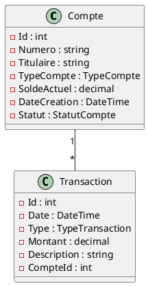

# 🎨 Instructions pour Ajouter les Maquettes et Diagrammes

## 📸 Maquettes Figma

### Étape 1 : Créer la maquette sur Figma
1. Aller sur https://www.figma.com
2. Créer un nouveau fichier "BanqueApp Maquettes"
3. Créer les écrans suivants :
   - Page de recherche (formulaire)
   - Page détails du compte (avec statistiques et transactions)
   - Page compte introuvable (erreur)

### Étape 2 : Exporter les maquettes
**Option A - Images PNG :**
1. Sélectionner chaque écran
2. File → Export → PNG (2x pour meilleure qualité)
3. Télécharger les fichiers

**Option B - Lien Figma (Recommandé) :**
1. Cliquer sur "Share" en haut à droite
2. Changer "Only people invited" → "Anyone with the link"
3. Copier le lien
4. Ajouter dans README.md

### Étape 3 : Ajouter au repository

**Si vous avez des images :**
```bash
# Placer les fichiers PNG dans Documentation/screenshots/
# Noms recommandés :
# - figma-page-recherche.png
# - figma-page-details.png
# - figma-page-erreur.png
```

**Si vous avez un lien Figma :**
Ajoutez dans le README :
```markdown
🎨 **Maquettes Figma** : [Voir sur Figma](VOTRE_LIEN_ICI)
```

---

## 📐 Diagrammes UML

### Outil recommandé : Draw.io

1. **Aller sur** : https://app.diagrams.net/
2. **Créer un diagramme de classes** :
   - Nouvelle feuille vierge
   - Utiliser les formes UML (à gauche)
   - Créer :
     - Classe **Compte** avec ses attributs
     - Classe **Transaction** avec ses attributs
     - Énumérations (TypeCompte, StatutCompte, TypeTransaction)
     - Relation 1-* entre Compte et Transaction

3. **Exporter** :
   - File → Export as → PNG (ou SVG)
   - Résolution : 300 DPI
   - Nom : `diagramme-classes-uml.png`

4. **Sauvegarder** dans `Documentation/images/`

### Alternative : PlantUML (Code)

Si vous préférez le code, créez un fichier `.puml` :



Puis générez l'image sur : http://www.plantuml.com/plantuml/

---

## 📁 Structure finale attendue

```
Documentation/
├── images/
│   └── diagramme-classes-uml.png       # Votre diagramme
├── screenshots/
│   ├── figma-page-recherche.png        # Maquette 1
│   ├── figma-page-details.png          # Maquette 2
│   └── figma-page-erreur.png           # Maquette 3
├── DiagrammeDeClasses.md               # Sera mis à jour avec l'image
├── DonneesDeTest.md
└── Maquettes.md                        # Sera mis à jour avec les images
```

---

## 🚀 Une fois vos fichiers prêts

### 1. Placer les fichiers dans les bons dossiers

### 2. Mettre à jour la documentation
Je mettrai à jour les fichiers MD pour référencer vos images

### 3. Commiter et pousser
```bash
git add Documentation/
git commit -m "Ajout des maquettes Figma et diagrammes UML"
git push
```

---

## ✅ Checklist

- [ ] Créer maquettes sur Figma (3 écrans minimum)
- [ ] Exporter les maquettes en PNG ou copier le lien Figma
- [ ] Créer le diagramme UML sur Draw.io
- [ ] Exporter le diagramme en PNG
- [ ] Placer les fichiers dans `Documentation/screenshots/` et `Documentation/images/`
- [ ] Me dire quand c'est fait pour que je mette à jour les fichiers MD

---

**Dites-moi quand vous aurez créé vos maquettes et diagrammes, je mettrai à jour la documentation !** 🎨
